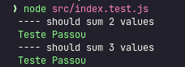

# Projeto testes sem bibliotecas

A ideia desse projeto foi entender um pouco sobre como funciona o TDD e os testes automatizados dentro do nodejs com base teórica.

### Material de estudo

["Uma introdução sobre testes como você nunca viu!" (canal codar.me)](https://youtu.be/Vg7uyraBKtM)

**Feito por Marcos Henrique usando o notion 🔥**